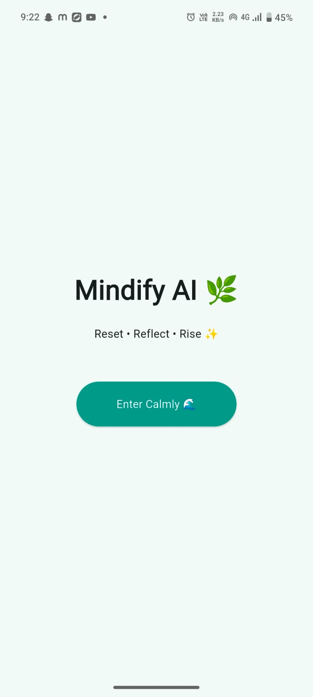
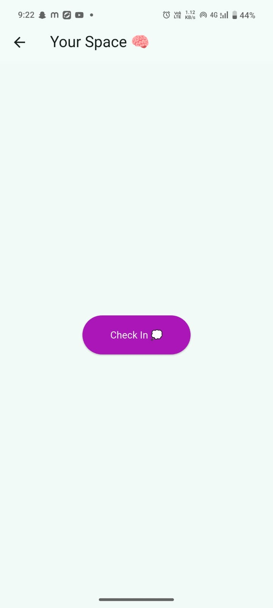
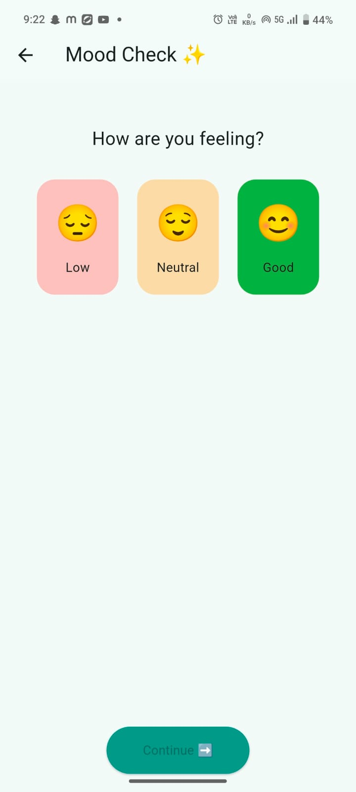
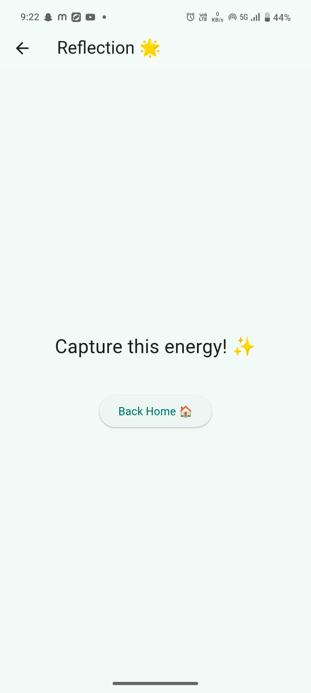
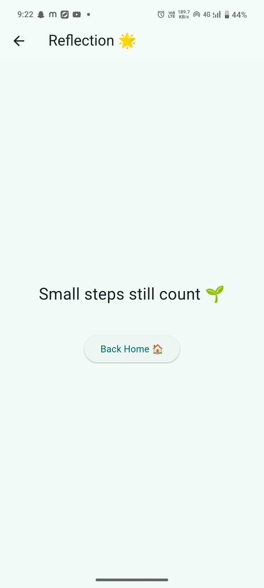
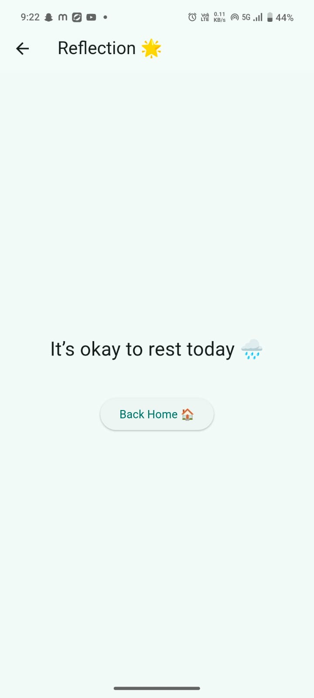

<h1 align="center">🧠 Mindify AI</h1>

A calm, minimal, emotionally-safe reflection app built using Flutter.

🌱 Reflect • 💎 Build Resilience • 📊 Track Growth

---

## 📂 Project Structure

resilience_app/
│
├── APP_INFO/
│ ├── logo.jpeg
│ ├── login_page.jpeg
│ ├── home_page.jpeg
│ ├── mood_check_page.jpeg
│ ├── good_click.jpeg
│ ├── neutral_click.jpeg
│ ├── low_click.jpeg
│
├── lib/
├── android/
├── pubspec.yaml
├── README.md

---

## ✨ About The Project

Mindify AI is a lightweight emotional reflection app designed to:

- Help users check their mood & energy
- Store reflections locally
- Reward honesty with resilience points
- Provide a calm and safe digital space

### 🛠 Built Using

- 💙 Flutter  
- 📦 sqflite (offline storage)  
- 🎨 Material 3 Design  

---

## 🎯 Key Features

✅ Clean & minimal UI  
✅ Mood check system (Low / Neutral / Good)  
✅ Energy tracking  
✅ Resilience Points system  
✅ Emotional feedback messages  
✅ Dashboard with growth timeline  
✅ Fully offline support  

---

# 📱 App Screens (Step-By-Step Flow)

---

### 🔰 1️⃣ App Logo

---

### 🌿 2️⃣ Login / Welcome Page

User enters the safe space calmly.

---

### 🏠 3️⃣ Home Screen

User can start logging a reflection.

---

### 🧘 4️⃣ Mood Check Page

User selects:

- Mood  
- Energy  
- Time  

---

### 😊 5️⃣ Mood: Good Selected

Encouraging message appears.

---

### 😌 6️⃣ Mood: Neutral Selected

Gentle reflection feedback shown.

---

### 😔 7️⃣ Mood: Low Selected

Supportive message appears.

---

# 🚀 How To Run This Project

## 🔹 Step 1: Clone the repository

git clone https://github.com/kavin553/mindify-ai.git

## 🔹 Step 2: Open the project folder

cd resilience_app

## 🔹 Step 3: Install dependencies

flutter pub get

## 🔹 Step 4: Run on Web (Chrome)

flutter run -d chrome

## 🔹 Step 5: Build APK (Android)

flutter build apk --release

APK location:

build/app/outputs/flutter-apk/app-release.apk

---

# 📦 Technologies Used

- Flutter 3.x
- Dart 3.x
- sqflite
- Material 3
- Kotlin (Android)
- HTML/CSS (Web build support)

---

# 🧠 Future Improvements

- 🌙 Dark Mode Support  
- ☁️ Cloud Sync Option  
- 📊 Graph-based Mood Analytics  
- 🤖 Improved Insight Engine  
- 🔐 Authentication Layer  
- 📱 Publish to Play Store  

---

# 👨‍💻 Developer Notes

This project was built with focus on:

✔ Emotional safety  
✔ Clean minimal design  
✔ Offline-first architecture  
✔ Beginner-friendly scalable structure  
✔ Practical Flutter learning  

---

<h3 align="center">🌱 Small steps matter. Reflection builds resilience.</h3>

---

# ⭐ If You Found This Project Useful

Give it a ⭐ on GitHub  
Share feedback  
Fork & improve  

